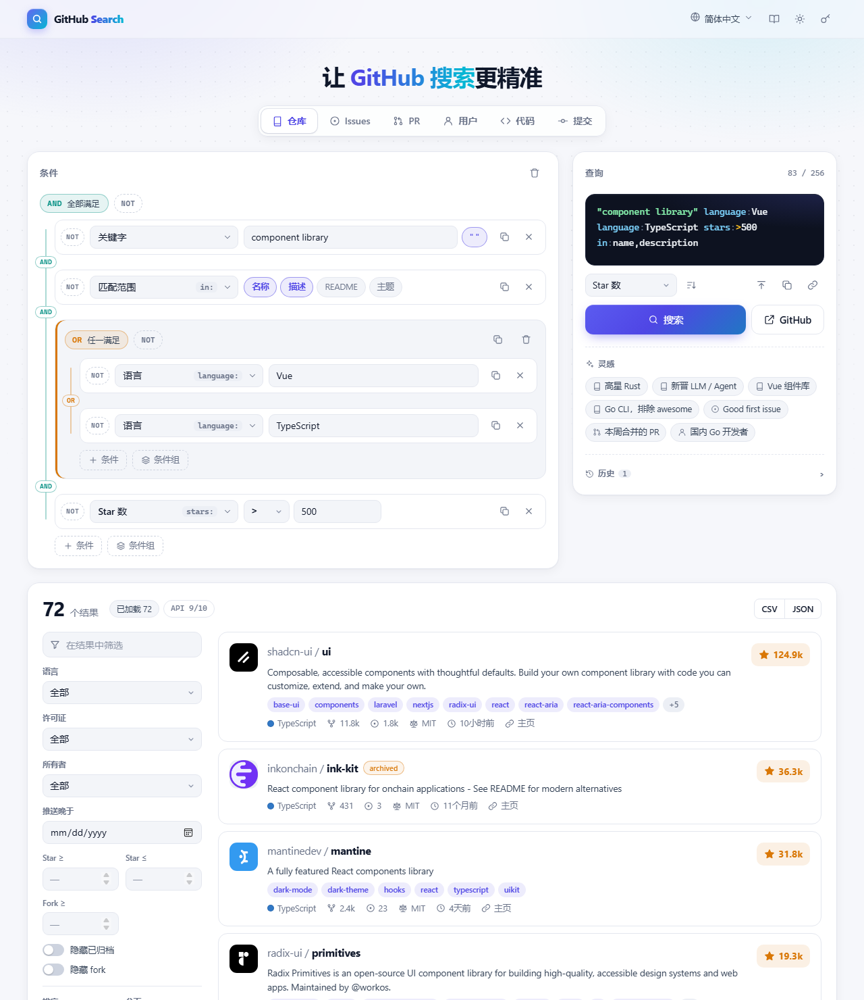

# gh-query

可视化构建 GitHub 搜索语法的网页工具。用条件组拼出 AND / OR / NOT 组合，生成可以直接粘进 GitHub 搜索框的查询字符串；也可以在页面里直接查询，对结果做二次筛选、排序和导出。

纯静态页面，没有后端，也不需要构建。

**在线使用：** https://YOUR_NAME.github.io/gh-query/



## 功能

- **条件构建**：支持仓库、Issues、Pull Requests、用户、代码、提交六种搜索类型，每种都带完整的限定符列表。条件组可以嵌套，组内切换 AND / OR，单个条件或整组都能取反。
- **双向编辑**：条件会实时生成查询字符串（带语法高亮）。也可以直接编辑或粘贴一段已有的查询语法，解析回条件树继续修改。
- **生成 GitHub 能执行的语法**：GitHub 的搜索语法有不少限制，工具会自动处理：取反下推到单个条件、`in:` 合并到最外层、同一字段的 OR 改写成 GitHub 支持的形式。实在无法写成一条查询时，会拆成子查询并说明原因。
- **页内查询**：通过 GitHub API 拉取结果，多个子查询的结果会合并去重。结果可以按语言、许可证、Star 区间、更新时间等筛选，在本地排序、分页，导出 CSV 或 JSON。
- **分享与历史**：当前查询可以生成链接分享；最近的查询自动保存在本地。
- **界面**：支持浅色 / 深色主题，以及简体中文、繁體中文、English、日本語、Français、Русский 六种语言，首次打开按浏览器语言自动选择。

## 快速开始

直接使用在线版即可。如果要在本地运行：

```bash
git clone https://github.com/YOUR_NAME/gh-query.git
cd gh-query
# 直接双击 index.html 打开，或起一个静态服务器：
python -m http.server 8080
```

### 部署到 GitHub Pages

1. Fork 或推送本仓库到自己的账号。
2. 进入仓库 **Settings → Pages**，Source 选择 **Deploy from a branch**，分支选 `main`，目录选 `/ (root)`。
3. 保存后稍等片刻，页面会发布在 `https://<用户名>.github.io/gh-query/`。

部署到其他平台（Nginx、对象存储、Vercel、Netlify 等）也一样，把整个目录作为静态文件托管就行。

## 使用说明

### 查询方式

| 操作 | 说明 |
|---|---|
| 搜索 | 在页面内调用 GitHub API 查询，结果显示在下方；在查询框中按 `Ctrl + Enter` 也可以 |
| GitHub | 在新标签页打开 GitHub 的搜索结果页，带上当前的排序设置 |
| 复制 | 复制查询字符串，可以粘贴到 GitHub 搜索框 |
| 同步到条件 | 把手动编辑过的查询字符串解析回条件 |

### 结果内筛选

结果列表上方的筛选框支持简单语法，只作用于已加载的结果：

| 写法 | 含义 |
|---|---|
| `react hooks` | 同时包含两个词 |
| `vue\|react` | 包含任意一个 |
| `-deprecated` | 排除 |
| `"design system"` | 完整短语 |

### GitHub Token（可选）

不设置 Token 也能用，只是 API 限额较低；代码搜索的 API 必须提供 Token。

| | 未设置 Token | 设置 Token |
|---|---|---|
| 仓库 / Issues / 用户 / 提交搜索 | 10 次/分钟 | 30 次/分钟 |
| 代码搜索 | 不可用 | 10 次/分钟 |

建议创建一个只有公开仓库只读权限的 [Fine-grained Token](https://github.com/settings/personal-access-tokens/new)。Token 只保存在当前浏览器的 localStorage 中，只会发送给 `api.github.com`。

## GitHub 搜索语法的限制

下面这些是 GitHub 自身的行为，不是本工具的限制。工具会尽量自动处理，但了解它们有助于理解为什么有时会提示“拆分为子查询”。

- **每个查询最多返回 1000 条结果**，这是 GitHub API 的上限。需要更多结果时，可以缩小条件范围（例如按创建时间分段）。
- **`in:` 作用于整条查询**，决定所有关键字在哪些字段里匹配，不能只作用于某一组条件。
- **仓库、用户、提交搜索只支持关键字之间的 OR。** 限定符之间的 OR（如 `topic:llm OR topic:ai-agent`）会返回 0 条，OR 与 `in:` 同时使用也会得到 0 条或错误的结果。
  - `language:`、`user:`、`org:` 重复出现时表示 OR，所以 `(language:Vue OR language:TypeScript)` 可以改写成 `language:Vue language:TypeScript`，工具会自动这样处理。
  - `topic:`、`repo:` 重复出现表示 AND，无法这样改写。这类查询会被拆成多个子查询：页内搜索会自动合并结果，在 GitHub 上则需要逐个打开。
- **Issues、Pull Requests 和网页版代码搜索**支持限定符之间的 OR 和括号，不受上面这条限制。
- **代码搜索的 API 与网页语法不同**：API 使用旧语法，网页使用新的代码搜索语法。字段选择里标有“API”或“网页”的限定符只在对应一侧生效。

## 浏览器支持

Chrome / Edge 111+、Firefox 113+、Safari 16.2+。

## 项目结构

```
index.html          页面入口
css/style.css       样式，包含浅色 / 深色主题
js/i18n.js          界面文案（六种语言）
js/schema.js        各搜索类型的限定符、排序项定义
js/query.js         查询表达式：解析、规范化、序列化、拆分子查询
js/builder.js       条件构建器
js/picker.js        下拉选择器
js/api.js           GitHub 搜索 API 请求
js/results.js       结果加载、筛选、排序、分页、导出
js/app.js           页面逻辑
js/icons.js         SVG 图标
```

没有第三方依赖，所有脚本以普通 `<script>` 方式加载，本地直接打开 `index.html` 也能运行。

## 参与贡献

欢迎提交 Issue 和 Pull Request。

- **补充或修正翻译**：修改 `js/i18n.js`，各语言的键需要保持一致。
- **新增限定符**：在 `js/schema.js` 中对应的搜索类型下添加字段，并在 `js/i18n.js` 中补充名称。
- **报告搜索结果异常**：请附上生成的查询字符串，以及在 GitHub 上实际搜索得到的结果，方便判断是工具的问题还是 GitHub 语法本身的限制。

## 许可证

见 [LICENSE](LICENSE)。
